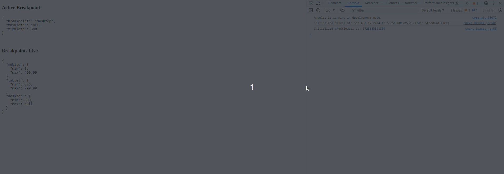

# Breakpoint Observer Angular Directive

A Angular Directive around `@breakpoint-observer/core`, Subscribe to breakpoint change.


### Installation

```bash
npm i -S @breakpoint-observer/angular
```

### Usage

### Configure Your own breakpoint

```typescript
import {
  ActiveBreakpoint,
  BreakpointObserverDirective,
  BreakpointService,
  BreakpointsList,
} from '@breakpoint-observer/angular';

// Setting Up Own Breakpoints
BreakpointService.setOptions({
  breakpoints: [{ mobile: 0 }, { tablet: 500 }, { desktop: 800 }],
});

// or it will default to inbuild bootstarap specification breakpoints

const defaultBreakpoints: BreakpointConfig = [
  { xs: 0 },  // breakpointName: minWidth
  { sm: 576 },
  { md: 768 },
  { lg: 992 },
  { xl: 1200 },
  { xxl: 1400 },
];

```

### Component 

```typescript

@Component({
  selector: 'app-child',
  imports: [BreakpointObserverDirective],
  standalone: true,
  template: `
    <div>
      <h3>Active Breakpoint:</h3>
      <pre>{{ activeBreakpoint | json }} </pre>
      <br />
      <h3>Breakpoints List:</h3>
      <pre>{{ breakpointsList | json }} </pre>
    </div>
  `,
})
export class ChildComponent {
  activeBreakpoint: ActiveBreakpoint;
  breakpointsList: BreakpointsList;

  constructor(
    @Optional() private observer?: BreakpointObserverDirective
  ) {}

  ngOnInit() {
    if (this.observer) {
      this.activeBreakpoint = this.observer.activeBreakpoint;
      this.breakpointsList = this.observer.breakpointsList;
      this.observer.breakpointChange.subscribe((args) => {
        this.activeBreakpoint = args[0];
        this.breakpointsList = args[1];
      });
    }
  }
}
```

And then use it in template

```html
<app-child  libBreakpointObserver></app-child>
```


### Demo

